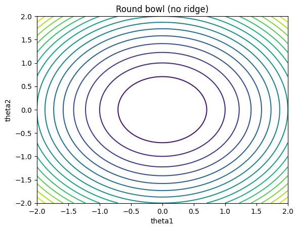
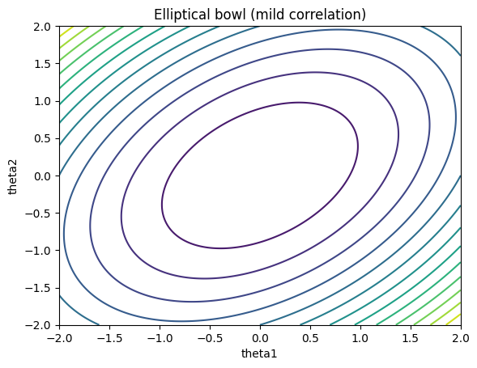
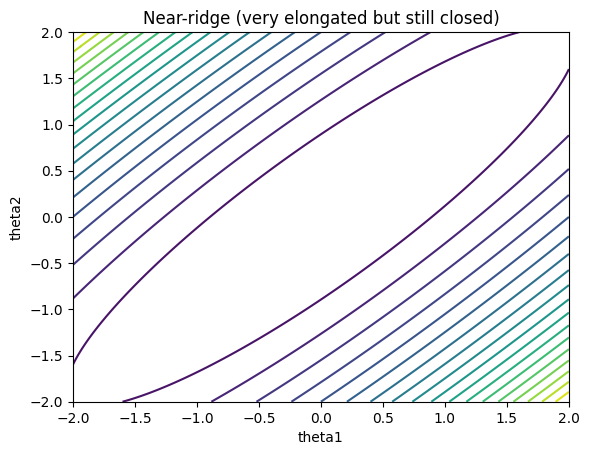

When working with likelihood-based models, it is often useful to first form a rough picture of the likelihood surface before choosing an optimization or sampling method. Contour plots and Hessians provide two complementary views of this shape: contours show how likelihood varies across directions, while Hessians summarize local curvature at a point.

Throughout this post, contour plots refer to level sets of the likelihood function  
$f(y;\theta)$ as a function of the parameter vector $\theta$. For visualization, $\theta$ is restricted to two dimensions, even though the underlying parameter space is typically higher-dimensional.

A simple reference case is the round bowl. The contour lines are closed and nearly circular. Moving away from the center produces similar changes in the likelihood in all directions. No direction appears noticeably flatter than others.

{width=65%}

When the parameters are highly correlated, the contour will be dense along the line $\theta_1 \approx \alpha \theta_2$. In this case, contours become elongated and rotated, forming an elliptical bowl. The likelihood still decreases in all directions, but at different rates depending on direction. Some directions are flatter than others, though none are close to flat.

{width=65%}

With stronger anisotropy, the contours stretch further and form a long, narrow corridor. The likelihood changes rapidly when moving across the corridor, while changes along the corridor are much slower. This type of shape is commonly referred to as a ridge.

{width=65%}

These visual differences correspond to differences in local curvature, which are summarized by the Hessian matrix. The Hessian is the matrix of second derivatives of the log-likelihood with respect to the parameters, evaluated at a point. Its eigenvalues describe curvature along orthogonal principal directions.

For example, a Hessian of the form

$$
\begin{pmatrix}
-50 & 10 \\
10 & -45
\end{pmatrix}
$$

has eigenvalues of comparable magnitude. Both principal directions exhibit similar curvature, which corresponds to the roughly circular contours above.

Increasing the off-diagonal terms produces stronger directional imbalance,

$$
\begin{pmatrix}
-50 & 20 \\
20 & -50
\end{pmatrix}.
$$

Here, one direction is flatter than the other, consistent with elongated but still well-behaved contours.

In a ridge-like case, the imbalance becomes extreme. A matrix such as

$$
\begin{pmatrix}
-50 & 49 \\
49 & -50
\end{pmatrix}
$$

has eigenvalues that differ by orders of magnitude. For instance, one eigenvalue may be on the order of $100$, while the other is close to $0.1$. This indicates strong curvature in one direction and an almost flat direction in another, matching the narrow corridor seen in the contour plot.

The separation between eigenvalues is often summarized by the condition number,

$$
\kappa = \frac{|\lambda_{\max}|}{|\lambda_{\min}|}.
$$

Large values correspond to highly uneven curvature. By contrast, the determinant only reflects the product of curvatures across directions: it becomes small when at least one direction is nearly flat, but it does not distinguish a ridge from a uniformly rescaled surface.

Contour plots and Hessians provide a compact way to form a basic picture of likelihood shape. Contours show how likelihood changes across directions in parameter space, while Hessians quantify this behavior locally at a point. Over time, reading these two objects side by side becomes a practical way to anticipate how different numerical methods are likely to behave.
